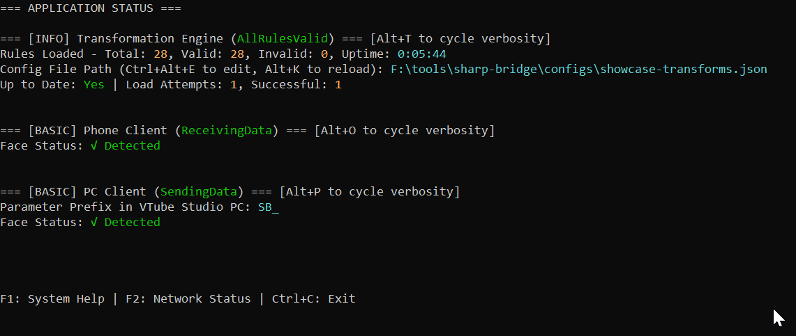
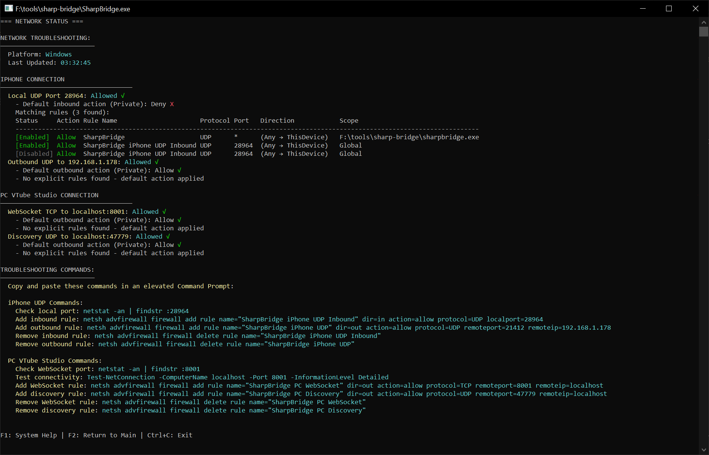

# Sharp Bridge

## What is Sharp Bridge?

Sharp Bridge is a **lightweight, real-time bridge application** that connects iPhone's VTube Studio to VTube Studio on PC.  
It processes face tracking data through a configurable transformation engine and delivers it seamlessly to your PC application via WebSocket communication.

## Why Sharp Bridge?

### 🚀 Lightweight & Efficient

We're a self-contained .NET-based executable with minimal resource usage - you can run it on a potato with 40Mb of RAM available and a spare change your CPU can offer.  
GPU Usage? What's a "GPU"?    
We're also **console-based** - because you can't have a heavy GUI if you don't have a GUI :3  

### ⚙️ Highly Configurable with a Solid Feature Set

Fully configurable iPhone blendshape → Custom PC VTube Studio parameter transformations with math expressions and functions & Bezier interpolations.  
All that in a fully transparent JSON configuration file you can open via in-app shortcut, edit and hot-reload at runtime.  

And we can be as verbose showing it as you want!  
* If you need every bit of detail when rigging, here you go:  

  

* ...or if you're a streamer who just needs it working, you can stick to the basics:  

  

  Whatever tickles your fancy!  

### 🛡️ Built for Stability & Reliability

We understand that streaming and content creation require rock-solid stability. That's why Sharp Bridge is designed with **automatic recovery** and **comprehensive diagnostics** at its core.

- **Automatic service recovery** - If connections drop or services fail, we automatically detect and restart them
- **Built-in diagnostics** - Real-time status monitoring with color-coded indicators and detailed troubleshooting information
- **Graceful error handling** - Invalid transformation configurations fall back to last working state, never leaving you stranded
- **Network troubleshooting tools** - If you do run into those pesky network setup issues, our built-in diagnostics and troubleshooting tools will help you get everything working smoothly:  

  

### 🆓 Completely Free!

No subscriptions, no paid features, no limitations. You're welcome.

## Quick Start

### Prerequisites
- iPhone with VTube Studio app
- PC with VTube Studio installed
- Both devices on the same network

### Installation & Setup
1. **Download** the latest release from [GitHub Releases](https://github.com/dimak01/sharp-bridge/releases)
2. **Extract** the ZIP file to your desired location
3. **Connect your devices** - Ensure iPhone VTube Studio and PC VTube Studio are running and connected
4. **Run** `SharpBridge.exe`
5. **Follow the setup** - The app will guide you through first-time configuration
6. **Start tracking** - Your iPhone face tracking will now appear in PC VTube Studio!

**Need help?** Check our [User Guide](docs/UserGuide/README.md) for detailed instructions and troubleshooting.

## Documentation

### [User Guide](docs/UserGuide/README.md)
Complete user documentation covering everything from getting started to advanced features. Includes console modes, configuration management, transformation rules, keyboard shortcuts, and troubleshooting guides.

### [Technical Documentation](docs/Technical/README.md)
Developer-focused documentation including system architecture, code organization, release processes, and development workflows. Perfect for understanding the codebase if you are feeling adventurous.

## Contributing

We welcome feedback and contributions from users! Here's how you can help:

- **Use the app** and provide feedback on your experience
- **Test pre-releases** and report any issues you encounter
- **Share your feedback** in release discussions
- **Suggest improvements** for features, documentation, or user experience

Your input helps make Sharp Bridge better for everyone!

## Acknowledgments

- [DenchiSoft](https://github.com/DenchiSoft/VTubeStudio) - For providing [an awesome documentation of their API](https://github.com/DenchiSoft/VTubeStudio?tab=readme-ov-file#api-details)! You rock! 
- [ovROG/rusty-bridge](https://github.com/ovROG/rusty-bridge) - An alternative lightweight Rust implementation that inspired this project and helped me figure out some of the initial steps - thanks folks!
- **VBridger** - Thanks for being a powerhouse while still providing room for niche/alternative solutions like this one to exist!

## License

This project is licensed under the MIT License - see the [LICENSE](LICENSE) file for details.