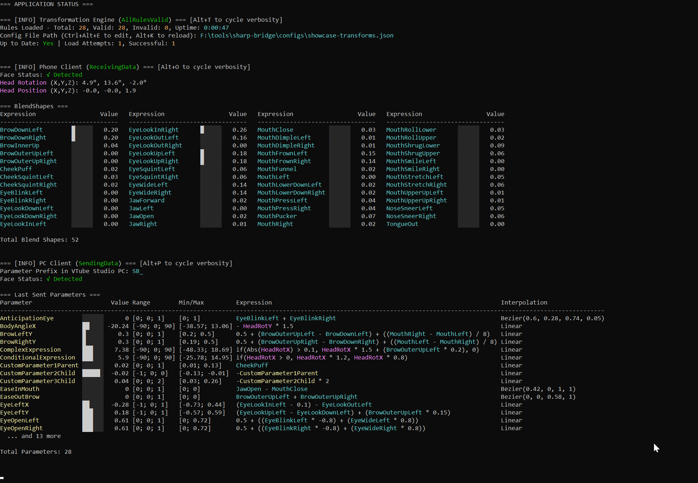

# Transformations

Transformations are the core of Sharp Bridge's functionality, defining how iPhone tracking data maps to VTube Studio parameters. This guide covers creating, editing, and optimizing transformation rules.

## Table of Contents

- [Understanding Transformations](#understanding-transformations)
- [Available Variables](#available-variables)
- [Mathematical Expressions](#mathematical-expressions)
- [Interpolation Methods](#interpolation-methods)
- [Parameter Dependencies](#parameter-dependencies)
- [Common Transformation Patterns](#common-transformation-patterns)
- [Advanced Techniques](#advanced-techniques)
- [Runtime Monitoring](#runtime-monitoring)
- [Editing Transformations](#editing-transformations)
- [Validation and Testing](#validation-and-testing)
- [Troubleshooting Transformations](#troubleshooting-transformations)
- [Best Practices](#best-practices)

## Understanding Transformations

### What Are Transformations?
Transformations are mathematical expressions that convert iPhone face tracking data into VTube Studio parameter values. Each transformation defines:
- **Parameter Name** - The VTube Studio parameter to control
- **Mathematical Function** - How to calculate the parameter value
- **Value Range** - Minimum and maximum allowed values
- **Default Value** - Fallback value when calculation fails

### Basic Structure
```json
{
  "name": "ParameterName",
  "func": "MathematicalExpression",
  "min": -1.0,
  "max": 1.0,
  "defaultValue": 0
}
```

## Available Variables

### Head Tracking
- **HeadRotX, HeadRotY, HeadRotZ** - Head rotation angles
- **HeadPosX, HeadPosY, HeadPosZ** - Head position coordinates

### Eye Tracking
- **EyeLeftX, EyeLeftY, EyeLeftZ** - Left eye coordinates
- **EyeRightX, EyeRightY, EyeRightZ** - Right eye coordinates

### BlendShape Variables
- **Dynamic Variables** - All variables from the iPhone's BlendShape data
- **Common Examples** (varies by device):
  - **EyeBlinkLeft, EyeBlinkRight** - Eye blink detection
  - **EyeLookUpLeft, EyeLookDownLeft** - Left eye vertical movement
  - **EyeLookUpRight, EyeLookDownRight** - Right eye vertical movement
  - **EyeLookInLeft, EyeLookOutLeft** - Left eye horizontal movement
  - **EyeLookInRight, EyeLookOutRight** - Right eye horizontal movement
  - **JawOpen** - Jaw opening amount
  - **MouthSmileLeft, MouthSmileRight** - Smile detection
  - **BrowInnerUp** - Inner brow raising
  - **And many more...** - Available variables depend on your iPhone model and VTube Studio app version

### Finding Available Variables
To see what BlendShape variables are available:
1. **Run Sharp Bridge** with face tracking active
2. **Switch to Main Status mode** (default mode)
3. **Enable Debug verbosity** - Press `Alt+O` to cycle Phone Client verbosity to Debug
4. **Check the console output** - All available BlendShape variables are displayed in the BlendShapes table
5. **Note the variable names** - Use these exact names in your transformation expressions

**Verbosity Levels:**
- **Basic**: Face detection status only
- **Normal**: Face status + position/rotation + limited BlendShapes table
- **Debug**: All above + complete BlendShapes table with all available variables



## Mathematical Expressions

### Basic Operations
- **Addition**: `HeadRotX + HeadRotY`
- **Subtraction**: `HeadRotX - HeadRotY`
- **Multiplication**: `HeadRotX * 2`
- **Division**: `HeadRotX / 2`
- **Parentheses**: `(HeadRotX + HeadRotY) * 2`

### Mathematical Functions
- **Absolute Value**: `Abs(HeadRotX)`
- **Minimum/Maximum**: `Min(HeadRotX, HeadRotY)`, `Max(HeadRotX, HeadRotY)`
- **Square Root**: `Sqrt(HeadRotX)`
- **Power**: `Pow(HeadRotX, 2)`
- **Exponential**: `Exp(HeadRotX)`
- **Logarithmic**: `Ln(HeadRotX)`, `Log(HeadRotX, 10)`, `Log10(HeadRotX)`
- **Rounding**: `Round(HeadRotX, 2)`, `Ceiling(HeadRotX)`, `Floor(HeadRotX)`, `Truncate(HeadRotX)`

### Trigonometric Functions
- **Sine/Cosine/Tangent**: `Sin(HeadRotX)`, `Cos(HeadRotY)`, `Tan(HeadRotZ)`
- **Inverse Trig**: `Asin(HeadRotX)`, `Acos(HeadRotY)`, `Atan(HeadRotZ)`

### Conditional Logic
- **If-Then-Else**: `if(HeadRotX > 0, HeadRotX, 0)`
- **Logical AND**: `HeadRotX > 0 && HeadRotY > 0`
- **Logical OR**: `HeadRotX > 0 || HeadRotY > 0`
- **Not**: `!HeadRotX` (converts to boolean, then negates)
- **Value in Set**: `in(HeadRotX, [0, 1, 2, 3])`

### Comparison Operators
- **Equality**: `HeadRotX == 0`, `HeadRotX != 0`
- **Relational**: `HeadRotX < 10`, `HeadRotY > -5`, `HeadRotZ <= 1`, `HeadRotX >= 0`

### Custom Clamp Function
Since NCalc doesn't have a built-in clamp function, use this pattern:
- **Clamp to Range**: `Min(Max(HeadRotX, -1), 1)`
- **Clamp to Positive**: `Max(HeadRotX, 0)`
- **Clamp to Negative**: `Min(HeadRotX, 0)`

## Interpolation Methods

### Overview
Interpolation controls how parameter values are smoothed between their calculated values and final output. Sharp Bridge supports two interpolation methods:

### Linear Interpolation (Default)
- **Behavior**: Direct 1:1 mapping (y = x)
- **Use Case**: Standard parameter mapping
- **Configuration**: No additional configuration needed

```json
{
  "name": "FaceAngleX",
  "func": "HeadRotX",
  "min": -30.0,
  "max": 30.0,
  "defaultValue": 0
}
```

### Bezier Curve Interpolation
- **Behavior**: Custom smooth curves using control points
- **Use Case**: Non-linear parameter responses, easing effects, overshooting curves, reverse curves
- **Control Points**: 2-8 points defining the curve shape (including start and end points)
- **Performance**: Limited to 8 control points for optimal performance
- **Flexibility**: Full control over curve shape - can overshoot, reverse, or use partial ranges

#### Bezier Configuration Examples

**Basic Smooth Curve:**
```json
{
  "name": "SmoothEyeX",
  "func": "EyeLookInLeft - EyeLookOutLeft",
  "min": -1.0,
  "max": 1.0,
  "defaultValue": 0,
  "interpolation": {
    "type": "BezierInterpolation",
    "controlPoints": [0, 0, 0.3, 0.1, 0.7, 0.9, 1, 1]
  }
}
```

**Overshooting Curve (reaches 1.0 early, then drops off):**
```json
{
  "name": "DramaticEyeX",
  "func": "EyeLookInLeft - EyeLookOutLeft",
  "min": -1.0,
  "max": 1.0,
  "defaultValue": 0,
  "interpolation": {
    "type": "BezierInterpolation",
    "controlPoints": [0, 0, 0.2, 0.3, 0.6, 1.0, 0.8, 0.8]
  }
}
```

**Note**: This curve reaches 1.0 at input 0.6, then drops to 0.8 at input 1.0. The rigger should design the parameter range wider (e.g., -1.5 to 1.5) to accommodate the overshoot.

**Reverse Curve (decreasing when input increases):**
```json
{
  "name": "InverseEyeX",
  "func": "EyeLookInLeft - EyeLookOutLeft",
  "min": -1.0,
  "max": 1.0,
  "defaultValue": 0,
  "interpolation": {
    "type": "BezierInterpolation",
    "controlPoints": [0, 1, 0.5, 0.5, 1, 0]
  }
}
```

**Note**: You must specify all control points including start and end points.

### Interpolation Behavior
- **Input Range**: 0.0 to 1.0 (normalized from min/max) - this is always fixed
- **Output Range**: Can exceed 0.0 to 1.0 range for dramatic effects (overshooting)
- **Overshooting Strategy**: Curves can reach 1.0 earlier in the input range, then "drop off" to values like 0.8-0.9
- **Rigger Responsibility**: Design parameter ranges wider than usual to accommodate extreme overshoots
- **Fallback**: Falls back to linear interpolation on errors
- **Performance**: Bezier curves are more CPU-intensive than linear
- **Limitations**: Cannot produce values outside the range of control point Y coordinates

### Understanding Overshooting Curves

**Key Concept**: Bezier interpolations are normalized 0 to 1, but parameters can have any range. With overshoot, the maximum value occurs before the end of the input range.

**The Challenge**: 
- **Normal case**: Parameter goes from min to max, with max at t=1 (fully open eyes at t=1)
- **Overshoot case**: Maximum value occurs at t<1, then "drops off" to 0.8-0.9 of max at t=1
- **Rigger's job**: Set up parameter ranges to accommodate both the exaggerated overshoot peak AND the normal-looking end state

**Example**: For eye opening with overshoot:
- Curve peaks at 1.0 when t=0.7 (exaggerated open)
- Drops to 0.8 when t=1.0 (normal-looking open)
- Rigger designs parameter range to accommodate both the overshoot peak and normal end state

### Designing Bezier Curves
Use external tools to design and visualize Bezier curves:

- **[cubic-bezier.com](https://cubic-bezier.com/)** - Interactive Bezier curve designer with preview
- **CSS Easing Functions** - Many tools support CSS cubic-bezier format
- **Control Point Format**: Convert from `cubic-bezier(x1, y1, x2, y2)` to `[x1, y1, x2, y2]` (middle control points only)
- **Format**: Use `controlPoints` array with middle control points only

### Common Easing Curves

#### Ease In (Slow Start)
```json
{
  "interpolation": {
    "type": "BezierInterpolation",
    "controlPoints": [0.42, 0, 1, 1]
  }
}
```

#### Ease Out (Slow End)
```json
{
  "interpolation": {
    "type": "BezierInterpolation", 
    "controlPoints": [0, 0, 0.58, 1]
  }
}
```

#### Ease In-Out (Slow Start and End)
```json
{
  "interpolation": {
    "type": "BezierInterpolation",
    "controlPoints": [0.42, 0, 0.58, 1]
  }
}
```


#### Anticipation (Reverse Start)
```json
{
  "interpolation": {
    "type": "BezierInterpolation",
    "controlPoints": [0.6, 0.28, 0.735, 0.045]
  }
}
```

#### Sharp Transition
```json
{
  "interpolation": {
    "type": "BezierInterpolation",
    "controlPoints": [0.55, 0.085, 0.68, 0.53]
  }
}
```

## Parameter Dependencies

### Overview
Parameters can depend on other calculated parameters, creating complex transformation chains. The system automatically resolves dependencies through multi-pass evaluation.

### How It Works
1. **First Pass**: Evaluates parameters with no dependencies
2. **Subsequent Passes**: Evaluates parameters that depend on previously calculated values
3. **Maximum Iterations**: Up to 10 passes (configurable)
4. **Abandoned Rules**: Rules that can't be evaluated after max iterations are marked as invalid

### Dependency Examples

**Simple Dependency:**
```json
{
  "name": "FaceAngleX",
  "func": "HeadRotX",
  "min": -30.0,
  "max": 30.0,
  "defaultValue": 0
},
{
  "name": "AdjustedFaceAngleX",
  "func": "FaceAngleX * 1.2",
  "min": -36.0,
  "max": 36.0,
  "defaultValue": 0
}
```

**Complex Dependency Chain:**
```json
{
  "name": "BaseEyeX",
  "func": "EyeLookInLeft - EyeLookOutLeft",
  "min": -1.0,
  "max": 1.0,
  "defaultValue": 0
},
{
  "name": "SmoothedEyeX",
  "func": "BaseEyeX * 0.8 + (PreviousValue * 0.2)",
  "min": -1.0,
  "max": 1.0,
  "defaultValue": 0
},
{
  "name": "FinalEyeX",
  "func": "SmoothedEyeX + (BrowOuterUpLeft * 0.1)",
  "min": -1.0,
  "max": 1.0,
  "defaultValue": 0
}
```

### Configuration
Set maximum evaluation iterations in `ApplicationConfig.json`:
```json
{
  "TransformationEngine": {
    "MaxEvaluationIterations": 10
  }
}
```

## Runtime Monitoring

### Min/Max Tracking
The system automatically tracks the actual minimum and maximum values observed for each parameter during runtime.

**What's Tracked:**
- **Runtime Min**: Lowest value observed during use
- **Runtime Max**: Highest value observed during use
- **Display**: Shows as "Min/Max" column in PC parameter table
- **Reset**: Extremums reset when transformation rules are reloaded

**Example Display:**
```
Parameter: FaceAngleX
Value: 15.2
Min/Max: Min: -28.5, Max: 31.2
```

### Status Indicators
- **Valid Rules**: Green checkmark for working transformations
- **Invalid Rules**: Red X for failed transformations with error details
- **Dependency Status**: Shows which rules depend on others
- **Evaluation Status**: Displays multi-pass evaluation progress

### Performance Monitoring
- **Transformation Count**: Total successful/failed transformations
- **Evaluation Time**: Time spent on multi-pass evaluation
- **Rule Complexity**: Number of dependencies per rule
- **Hot Reload Status**: Success/failure of configuration reloads

## Common Transformation Patterns

### Simple Mapping
```json
{
  "name": "FaceAngleX",
  "func": "HeadRotX",
  "min": -30.0,
  "max": 30.0,
  "defaultValue": 0
}
```

### Scaled Mapping
```json
{
  "name": "FaceAngleY",
  "func": "HeadRotY * 1.5",
  "min": -45.0,
  "max": 45.0,
  "defaultValue": 0
}
```

### Inverted Mapping
```json
{
  "name": "FacePositionX",
  "func": "HeadPosX * -1",
  "min": -15.0,
  "max": 15.0,
  "defaultValue": 0
}
```

### Combined Mapping
```json
{
  "name": "MouthOpen",
  "func": "JawOpen - MouthClose",
  "min": 0.0,
  "max": 1.0,
  "defaultValue": 0
}
```

### Complex Expression with Interpolation
```json
{
  "name": "EyeRightY",
  "func": "(EyeLookUpRight - EyeLookDownRight) + (BrowOuterUpRight * 0.15)",
  "min": -1.0,
  "max": 1.0,
  "defaultValue": 0,
  "interpolation": {
    "type": "BezierInterpolation",
    "controlPoints": [0.2, 0.1, 0.8, 0.9]
  }
}
```

## Advanced Techniques

### Dead Zones and Thresholds
- **Dead zones**: `Abs(HeadRotX) > 0.1 ? HeadRotX : 0`
- **Threshold activation**: `HeadRotX > 0.05 ? HeadRotX : 0`
- **Hysteresis**: `HeadRotX > 0.1 ? HeadRotX : (HeadRotX < -0.1 ? HeadRotX : 0)`

### Smoothing and Filtering
- **Exponential smoothing**: `HeadRotX * 0.8 + (PreviousValue * 0.2)`
- **Moving average**: `(HeadRotX + PreviousValue1 + PreviousValue2) / 3`
- **Low-pass filtering**: `HeadRotX * 0.7 + (PreviousValue * 0.3)`

### Conditional Logic
- **Conditional parameters**: Only calculate when certain conditions are met
- **Cascading effects**: One parameter affects multiple others
- **State-dependent calculations**: Different formulas based on face detection status

### Step Functions
Create discrete step functions using nested conditional logic:

```json
{
  "name": "BodyPositionXSteps",
  "func": "if(BodyPositionX <= -12, 0, if(BodyPositionX <= -9, 1, if(BodyPositionX <= -6, 2, if(BodyPositionX <= -3, 3, if(BodyPositionX <= 0, 4, if(BodyPositionX <= 3, 5, if(BodyPositionX <= 6, 6, if(BodyPositionX <= 9, 7, if(BodyPositionX <= 12, 8, 10)))))))))",
  "min": 0,
  "max": 10,
  "defaultValue": 0
}
```

**Step Function Benefits:**
- **Discrete Values**: Outputs only specific values (0, 1, 2, 3, 4, 5, 6, 7, 8, 10)
- **Threshold-Based**: Changes value only when crossing defined thresholds
- **No Smooth Interpolation**: Creates sharp transitions between steps
- **Custom Ranges**: Each step can have different value ranges

**Simpler Step Function Example:**
```json
{
  "name": "EyeBlinkSteps",
  "func": "if(EyeBlinkLeft < 0.1, 0, if(EyeBlinkLeft < 0.5, 1, 2))",
  "min": 0,
  "max": 2,
  "defaultValue": 0
}
```

### Performance Optimization
- **Simplify expressions** - Avoid unnecessary calculations
- **Use appropriate ranges** - Set realistic min/max values
- **Avoid complex conditionals** - Keep expressions straightforward
- **Test thoroughly** - Verify performance with complex expressions

## Editing Transformations

### Using External Editor
1. **Open Main Status Mode** (default mode)
2. **Press `Ctrl+Alt+E`** to open Parameter Transformations Config JSON
3. **Edit transformation rules** as needed
4. **Save the file**
5. **Press `Alt+K`** to reload transformations

### Manual Editing
1. **Open Parameter Transformations Config JSON** in your preferred editor
2. **Edit the transformation rules**
3. **Save the file**
4. **Press `Alt+K`** in the application to reload

## Validation and Testing

### Automatic Validation
- **JSON syntax** - Ensures valid JSON format
- **Required fields** - Verifies all necessary fields are present
- **Value ranges** - Validates min/max values are appropriate
- **Expression syntax** - Checks mathematical expressions are valid

### Testing Transformations
1. **Start with simple expressions** - Test basic functionality first
2. **Use the console** - Monitor parameter values in real-time
3. **Test edge cases** - Verify behavior at min/max values
4. **Check performance** - Ensure expressions don't cause lag

## Troubleshooting Transformations

### Common Issues
- **Invalid expressions** - Check mathematical syntax
- **Out of range values** - Verify min/max values are appropriate
- **Performance problems** - Simplify complex expressions
- **Unexpected behavior** - Test expressions step by step

### Debugging Tips
1. **Use simple expressions** - Start with basic operations
2. **Test incrementally** - Make one change at a time
3. **Check console output** - Look for error messages
4. **Verify variable names** - Ensure all variables are spelled correctly
5. **Test with real data** - Use actual tracking data for testing

## Best Practices

### Expression Design
- **Keep it simple** - Avoid overly complex expressions
- **Use meaningful names** - Choose descriptive parameter names
- **Document complex logic** - Add comments for complex expressions
- **Test thoroughly** - Verify behavior with various inputs

### Performance
- **Optimize calculations** - Use efficient mathematical operations
- **Avoid redundant calculations** - Don't repeat the same operations
- **Use appropriate precision** - Don't over-specify decimal places
- **Monitor resource usage** - Watch for high CPU usage

### Maintenance
- **Version control** - Track changes to transformation files
- **Backup configurations** - Keep copies of working configurations
- **Document changes** - Record what each transformation does
- **Regular testing** - Verify transformations work after updates
