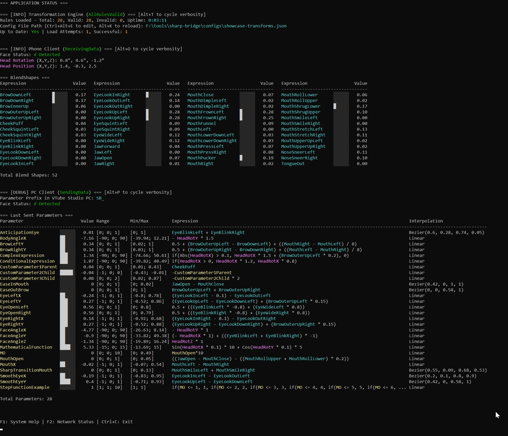
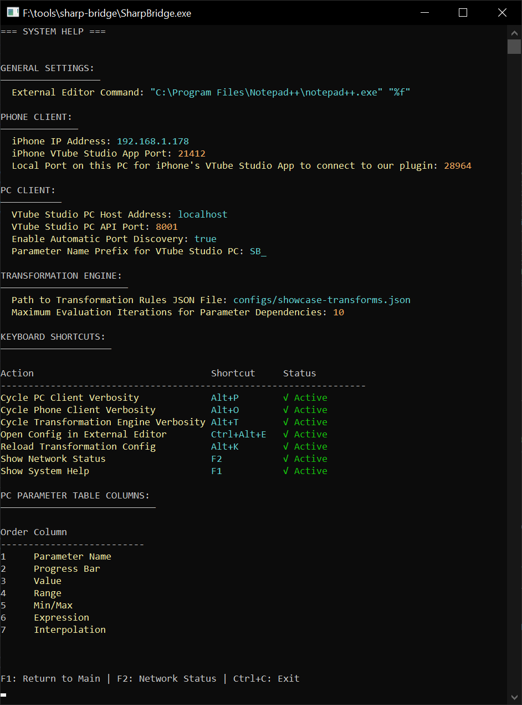
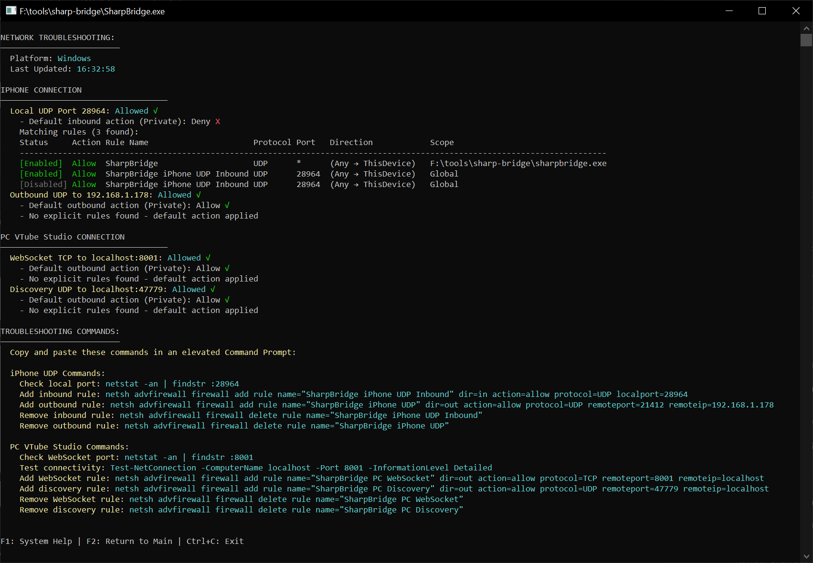

# Console Modes

Sharp Bridge provides three distinct console modes, each optimized for different tasks. Use **F1** and **F2** to navigate between modes (Main Status is the default).

## Main Status Mode (Default)

**Purpose**: Real-time monitoring of tracking data and system status

### What You'll See
- **Connection Status**: iPhone and PC connection indicators
- **Parameter Values**: Live tracking data from your iPhone
- **Transformation Engine**: Status of rule processing and configuration
- **Face Detection**: Real-time face detection status from both devices
- **Error/Warning Messages**: Any issues that need attention

    

### Key Information Displayed
- **Transformation Engine**: Number of valid/invalid rules, config file path, up-to-date status
- **Phone Client**: Face detection status, position/rotation data, blend shapes
- **PC Client**: Face detection status, parameter values
- **Service Status**: Running/stopped status for all components

### When to Use
- **During normal operation** - Primary mode for monitoring
- **Troubleshooting connections** - Check if devices are communicating
- **Monitoring face detection** - Verify face is detected
- **Real-time feedback** - See how your face movements translate to parameters

## System Help Mode (F1)

**Purpose**: Configuration management and system information

### What You'll See
- **Configuration Sections**: Current settings for all application components
- **Keyboard Shortcuts**: Table of all available shortcuts with status
- **Parameter Table Columns**: PC parameter table column configuration

    

### Key Information Displayed
- **General Settings**: Editor command and other general configuration
- **Phone Client Config**: IP address, ports, connection settings
- **PC Client Config**: Host, port, discovery settings
- **Transformation Engine**: Config path, evaluation settings
- **Keyboard Shortcuts**: All shortcuts with their current status (Active/Invalid/Disabled)
- **Parameter Columns**: Order and configuration of PC parameter table columns

### When to Use
- **Configuration review** - Check current settings for all components
- **Shortcut reference** - See all available keyboard shortcuts and their status
- **Parameter table setup** - Configure PC parameter table column display
- **Configuration editing** - Use Ctrl+Alt+E to edit application config

## Network Status Mode (F2)

**Purpose**: Network diagnostics and connectivity troubleshooting

### What You'll See
- **Platform Information**: Current platform and last update time
- **iPhone Connection Status**: UDP port firewall analysis and rules
- **PC VTube Studio Connection Status**: WebSocket and discovery port firewall analysis
- **Troubleshooting Commands**: Copy-paste firewall configuration commands

    

### Key Information Displayed
- **iPhone UDP Port**: Local port status and firewall rules
- **iPhone Outbound**: Outbound UDP to iPhone status and rules
- **PC WebSocket**: TCP connection to PC VTube Studio status and rules
- **PC Discovery**: UDP discovery port status and rules
- **Firewall Commands**: Ready-to-use commands for adding/removing firewall rules

### When to Use
- **Firewall troubleshooting** - Check if firewall is blocking connections
- **Firewall setup** - Get copy-paste commands to configure Windows Firewall
- **Connection diagnosis** - See detailed firewall analysis for each connection
- **Rule management** - Add or remove Sharp Bridge firewall rules

## Navigation Between Modes

### Keyboard Shortcuts
- **F1** - Switch to System Help Mode
- **F2** - Switch to Network Status Mode
- **Ctrl+C** - Quit application (from any mode)

### Mode-Specific Actions
Each mode has context-specific keyboard shortcuts:
- **Main Status**: `Alt+K` (reload transformations), `Ctrl+Alt+E` (edit transformations)
- **System Help (F1)**: `Ctrl+Alt+E` (edit application config)
- **Network Status (F2)**: `Ctrl+Alt+E` (edit application config)

## Tips for Effective Use

### Main Status Mode
- **Watch for connection indicators** - Green means connected, red means disconnected
- **Monitor parameter values** - Ensure they're updating in real-time
- **Check error messages** - Address any warnings or errors promptly

### System Help Mode (F1)
- **Review configuration** - Verify settings match your setup
- **Check file paths** - Ensure configuration files are accessible
- **Monitor service status** - All services should show as "Running"

### Network Status Mode (F2)
- **Use firewall commands** - Copy and run the provided commands if needed
- **Check port availability** - Ensure required ports are not blocked
- **Test connectivity** - Use the provided ping tests to verify network access

## Common Mode Usage Patterns

1. **Startup**: Begin in Main Status to verify connections
2. **Configuration**: Press F1 to switch to System Help to review settings
3. **Troubleshooting**: Press F2 to use Network Status for connection issues
4. **Monitoring**: Return to Main Status for ongoing operation
