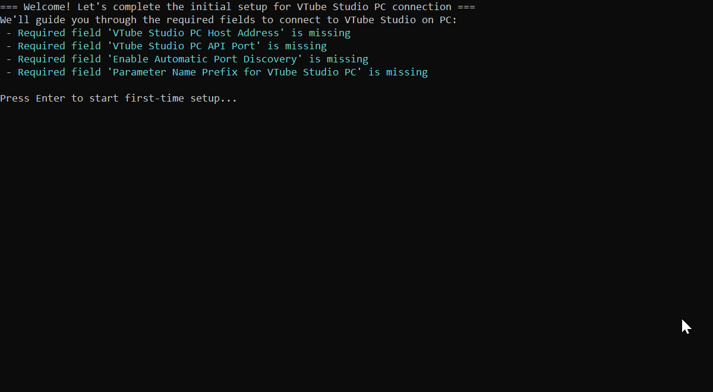

# Getting Started with Sharp Bridge

## Quick Start

### Prerequisites
- **VTube Studio** running on your PC
- **VTube Studio app** on your iPhone (connected to the same network)
- **Windows 10/11** (x64)

### Basic Workflow

1. **Start VTube Studio on your PC**
2. **Start tracking on your iPhone VTube Studio app**
3. **Launch Sharp Bridge** (`SharpBridge.exe`)
4. **Follow the first-time setup prompts** if this is your first time
5. **Wait for initialization to complete** (watch the progress display)
6. **Watch the Main Status mode** for connection confirmations

### Basic Operation

Once running, Sharp Bridge will:
- **Receive tracking data** from your iPhone via UDP
- **Process the data** using your transformation rules
- **Send transformed data** to VTube Studio on your PC
- **Display real-time status** in the console interface

### Stopping a Session

- **Press `Ctrl+C`** to quit the application
- **Or close the console window**

### Firewall Setup (If Needed)

If you encounter connection issues:
- **Use Network Status mode (F2)** for detailed diagnostics
- **The app will provide firewall configuration commands** when needed
- **Follow the displayed commands** to configure Windows Firewall

## What Happens Next

After successful startup, you'll see the **Main Status mode** showing:
- Connection status to both iPhone and PC
- Real-time parameter values
- Transformation engine status
- Any errors or warnings

    

From here, you can:
- **Navigate between modes** using F1 (System Help) and F2 (Network Status)
- **Edit configurations** using Ctrl+Alt+E
- **Monitor performance** and troubleshoot issues
- **Customize transformations** for your specific needs

## Next Steps

- **[Learn about Console Modes](ConsoleModes.md)** - Understanding the different interface modes
- **[Configure Settings](Configuration.md)** - Customizing your setup
- **[Explore Advanced Features](AdvancedFeatures/README.md)** - Transformations, shortcuts, and more
- **[Troubleshoot Issues](Troubleshooting.md)** - Common problems and solutions
