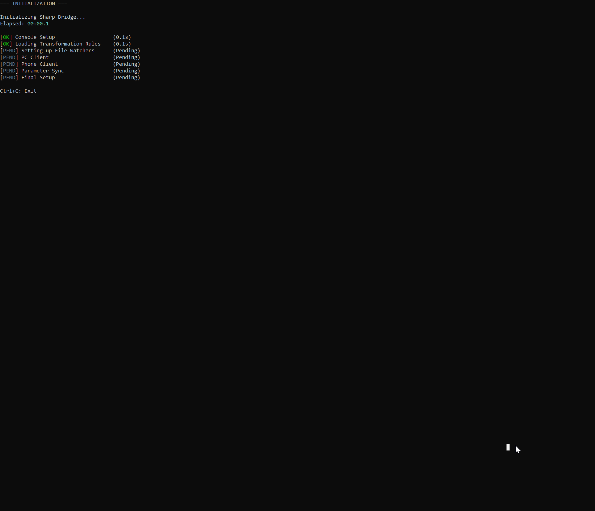

# Sharp Bridge User Guide

Welcome to the Sharp Bridge User Guide! This guide will help you get started with Sharp Bridge and learn how to use its features effectively.

## Quick Start

1. **Start VTube Studio** on your PC
2. **Start tracking** on your iPhone VTube Studio app
3. **Launch Sharp Bridge** (`SharpBridge.exe`)
4. **Follow setup prompts** if this is your first time
5. **Watch the progress** during initialization
6. **Monitor connections** in Main Status mode
7. **Explore different modes** - Press F1 for System Help or F2 for Network Status
8. **Review settings** - Use Ctrl+Alt+E to edit configurations as needed  

  

## Quick Navigation

### Getting Started
- **[Getting Started](GettingStarted.md)** - Prerequisites, first-time setup, and basic workflow
- **[Console Modes](ConsoleModes.md)** - Understanding the three interface modes
- **[Configuration](Configuration.md)** - Managing application settings and preferences

### Advanced Features
- **[Advanced Features](AdvancedFeatures/README.md)** - Power user functionality
  - **[Transformations](AdvancedFeatures/Transformations.md)** - Creating custom parameter mappings
  - **[Keyboard Shortcuts](AdvancedFeatures/KeyboardShortcuts.md)** - Efficient navigation and control
  - **[External Editor](AdvancedFeatures/ExternalEditor.md)** - Seamless configuration editing

### Support
- **[Troubleshooting](Troubleshooting.md)** - Common issues and solutions

## Console Modes

- **Main Status** - Real-time monitoring and parameter display (default)
- **F1 - System Help** - Configuration management and system information
- **F2 - Network Status** - Network diagnostics and troubleshooting

## Need Help?

- **Check the console** - Look for error messages and status information
- **Review logs** - Check the `logs/` directory for detailed information
- **Use Network Status mode** - Run diagnostics for connection issues
- **Consult [Troubleshooting](Troubleshooting.md)** - Common problems and solutions

Ready to get started? Begin with [Getting Started](GettingStarted.md) to set up your first session!